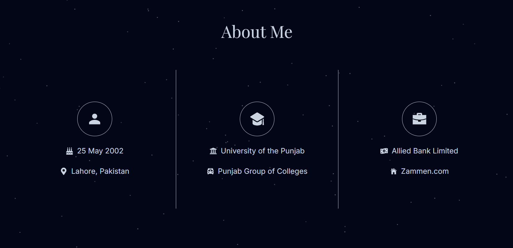
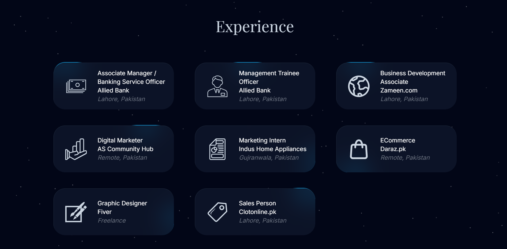
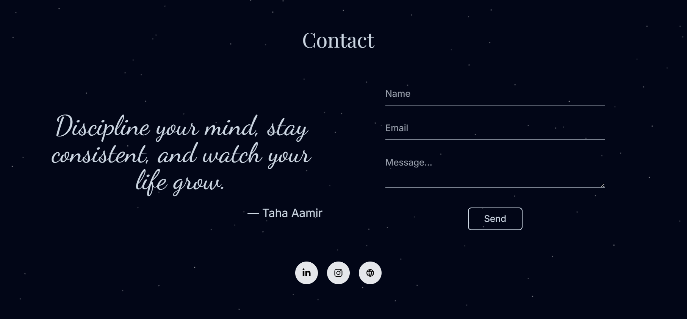

# Taha Aamir – Personal Portfolio Website

A modern personal portfolio website showcasing professional experience, background, achievements, and social presence, along with a contact form powered by Nodemailer for direct communication.

> Built with Next.js, React.js, Tailwind CSS, Aceternity UI, and deployed on Vercel.


## Live Demo

https://taha-aamir-weld.vercel.app

## Overview

This portfolio website was developed to present an online presence and professionally showcase Taha Aamir's experience, skills, and career journey.

The website combines modern UI design, smooth animations, and responsive layouts to create an engaging experience for visitors while providing an easy way to connect through social platforms and a contact form.


## Features

* Professional landing page
* About Me section
* Experience showcase
* Contact form using Nodemailer
* Animated social media section
* Responsive design
* Modern UI powered by Aceternity UI


## Sections

* Intro
* About Me
* Experience
* Contact
* Social Links


## Tech Stack

### Frontend

* Next.js
* React.js
* Tailwind CSS
* Aceternity UI

### Services

* Nodemailer

### Deployment

* Vercel


## Screenshots

### Home


### About



### Experience



### Contact




## Project Structure

```text
taha-aamir-portfolio/
├── app/
│   ├── api/
│   │   └── contact/
│   ├── components/
│   ├── lib/
│   ├── svgs/
│   ├── favicon.ico
│   ├── globals.css
│   ├── layout.js
│   └── page.js
└── public/
```


## Key Challenges

* Creating smooth and modern UI animations
* Integrating reliable email communication


## What I Learned

* Next.js component structuring
* Modern UI design with Aceternity UI
* Contact form integration using Nodemailer


## Future Improvements

* Blog section
* Project showcase expansion
* CMS-based content management
* Dark/Light theme toggle

## If you found this project interesting, consider giving it a star ⭐
